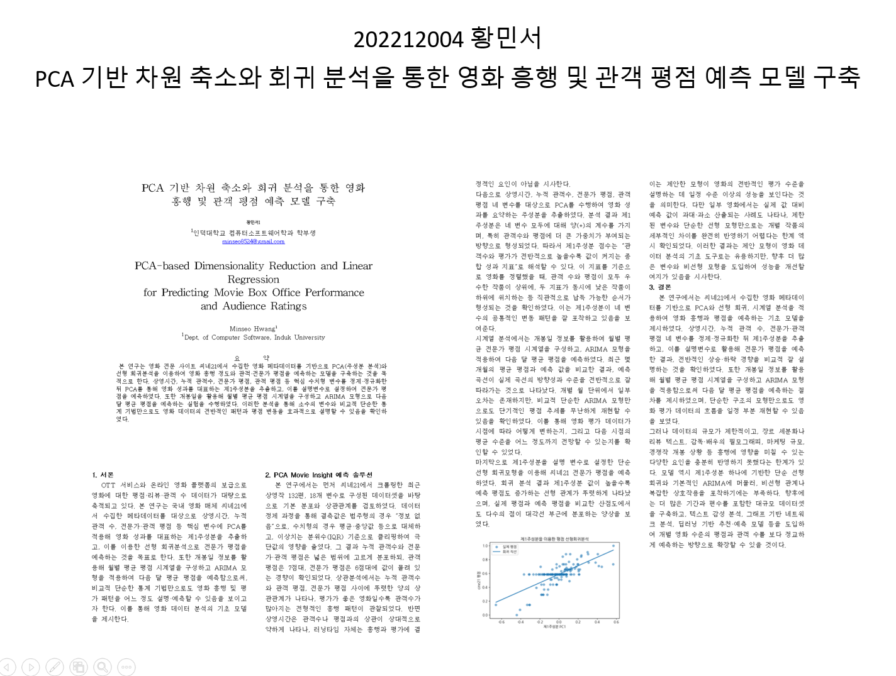

# Cine21 영화 데이터 PCA·회귀 분석 프로젝트

Cine21 영화 데이터를 수집한 뒤 결측값 처리, 이상치 처리, 중복 제거, 정규화, PCA, 상관관계 분석, ARIMA 기반 시계열 예측, 선형회귀 분석까지 수행한 데이터 분석 프로젝트입니다.



## 프로젝트 개요

- 주제: PCA 기반 차원 축소와 회귀 분석을 통한 영화 흥행 및 관객 평점 예측 모델 구축
- 데이터 출처: Cine21 영화 정보 페이지
- 분석 대상: 영화 기본 정보, 개봉일, 등급, 상영 시간, 누적 관객 수, 장르, 국가, 감독, 출연진, 전문가 평점, 관객 평점
- 데이터 규모: 150행, 18개 컬럼
- 주요 목표: 영화 메타데이터를 기반으로 평점과 흥행 지표의 관계를 분석하고, PCA와 회귀 분석을 통해 예측 가능성을 확인

## 주요 기능

1. Cine21 상영작 목록 및 상세 정보 크롤링
2. 영화별 기본 정보와 평점 데이터 병합
3. 결측값 처리 및 이상치 처리
4. 중복 데이터 제거
5. MinMaxScaler 기반 정규화
6. PCA를 활용한 주성분 분석과 설명력 계산
7. 피어슨, 스피어만, 켄달 상관계수 분석
8. ARIMA 기반 월별 평균 평점 예측
9. PC1 기반 선형회귀 분석
10. 실제 평점과 예측 평점 시각화

## 사용 기술

- Python
- Google Colab / Jupyter Notebook
- pandas
- requests
- BeautifulSoup4
- scikit-learn
- statsmodels
- matplotlib

## 프로젝트 구조

```text
movie-pca-rating-analysis/
├── README.md
├── requirements.txt
├── .gitignore
├── data/
│   └── hms202212004.csv
├── notebooks/
│   └── hms_project_202212004.ipynb
├── src/
│   └── hms_project_202212004.py
└── docs/
    ├── poster_202212004_hwang_minseo.png
    ├── presentation_202212004_hwang_minseo.pptx
    └── report_202212004_hwang_minseo.hwp
```

## 데이터 컬럼

| 컬럼명 | 설명 |
|---|---|
| movie_id | 영화 고유 ID |
| title | 영화 제목 |
| rank | 수집 순위 |
| title_ko | 국문 제목 |
| title_en | 영문 제목 |
| year | 제작 연도 |
| open_date_detail | 개봉일 |
| rating | 관람 등급 |
| runtime_min | 상영 시간 |
| audience_total | 누적 관객 수 |
| genres | 장르 |
| country | 제작 국가 |
| directors | 감독 |
| num_directors | 감독 수 |
| cast_main | 주요 출연진 |
| num_cast_main | 주요 출연진 수 |
| cine21_score_detail | Cine21 전문가 평점 |
| netizen_score | 관객 평점 |

## 실행 방법

```bash
pip install -r requirements.txt
```

노트북 실행:

```bash
jupyter notebook notebooks/hms_project_202212004.ipynb
```

파이썬 파일 실행:

```bash
python src/hms_project_202212004.py
```

로컬 환경에서 그래프 한글이 깨질 경우 NanumGothic 또는 다른 한글 폰트를 설치한 뒤 matplotlib 폰트 설정을 변경해야 합니다.

## 분석 흐름

```text
데이터 크롤링
→ 상세 데이터 수집
→ 데이터 병합
→ 결측값 처리
→ 이상치 처리
→ 중복 제거
→ 정규화
→ PCA
→ 상관관계 분석
→ 시계열 예측
→ 선형회귀 분석
```

## 결과 요약

- 상영 시간, 누적 관객 수, 전문가 평점, 관객 평점 변수를 기반으로 PCA를 수행했습니다.
- 주성분을 활용해 여러 수치형 변수를 하나의 축으로 요약하고, 평점 예측에 활용했습니다.
- PC1을 설명변수로 사용한 선형회귀분석을 통해 실제 평점과 예측 평점의 관계를 시각화했습니다.
- 월별 평균 전문가 평점을 기준으로 ARIMA 시계열 예측을 수행했습니다.

## GitHub 업로드 예시

```bash
git init
git add .
git commit -m "Add movie PCA rating analysis project"
git branch -M main
git remote add origin https://github.com/allen8524/movie-pca-rating-analysis.git
git push -u origin main
```

이미 원격 저장소를 만든 상태라면 `git remote add origin`의 주소만 본인 저장소 주소에 맞게 바꾸면 됩니다.
