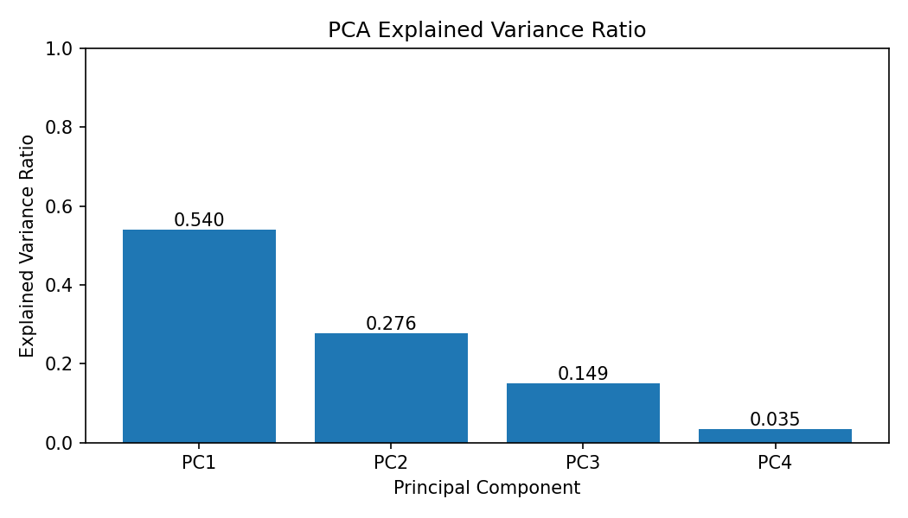
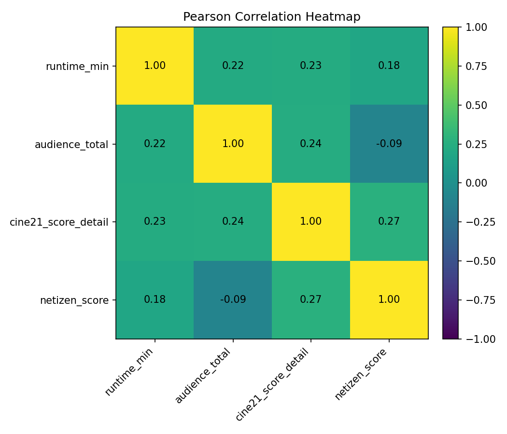
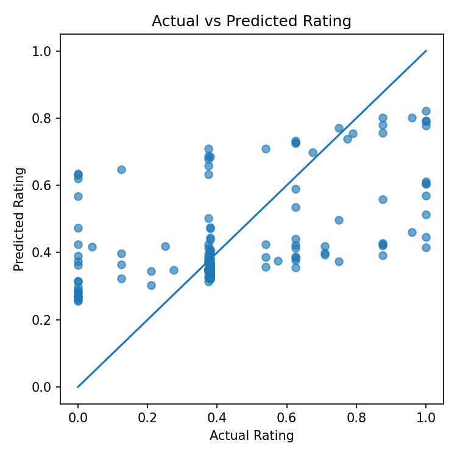

# Cine21 영화 데이터 PCA·회귀 분석 프로젝트

Cine21 영화 데이터를 수집·전처리하고 PCA, 상관분석, ARIMA, 선형회귀를 활용해 영화 평점과 흥행 지표의 관계를 분석한 데이터 분석 프로젝트입니다.


## 프로젝트 개요

- **주제:** PCA 기반 차원 축소와 회귀 분석을 통한 영화 평점·흥행 지표 관계 분석
- **데이터 출처:** Cine21 영화 정보 페이지 (저장된 CSV 사용)
- **분석 대상:** 영화 메타데이터(개봉일, 등급, 상영 시간, 누적 관객 수 등) 및 평점
- **데이터 규모:** 약 150행, 다수의 메타컬럼(원본 CSV 참조)
- **주요 목표:** 수치형 변수의 차원 축소(PCA), 변수 간 상관성 비교, 시계열 예측(ARIMA), PC1 기반 회귀모형 평가

## 주요 기능

- Cine21에서 수집한 저장 CSV 기반 전처리 및 분석
- 원본 노트북에는 데이터 수집 과정이 포함되어 있으며, 실행 스크립트는 저장된 CSV를 기준으로 재현 가능한 분석을 수행
- 결측값 처리, 이상치 처리, 중복 제거
- MinMaxScaler 기반 정규화 및 PCA 수행
- 피어슨/스피어만/켄달 상관계수 비교
- ARIMA 기반 월별 평균 평점 예측(가능한 경우)
- 제1주성분(PC1) 기반 선형회귀 분석 및 평점 예측 비교

## 사용 기술

- Python
- Jupyter Notebook / Google Colab
- pandas, numpy
- requests, BeautifulSoup4
- scikit-learn, statsmodels
- matplotlib

## 프로젝트 구조

```text
movie-pca-rating-analysis/
├── README.md
├── requirements.txt
├── .gitignore
├── data/
│   └── hms202212004.csv
├── notebooks/
│   └── hms_project_202212004.ipynb
├── src/
│   └── hms_project_202212004.py
├── outputs/
│   ├── .gitkeep
│   └── analysis_summary.txt
└── docs/
    ├── images/
    │   ├── pca_explained_variance.png
    │   ├── correlation_heatmap.png
    │   └── actual_vs_predicted.png
    ├── poster_202212004_hwang_minseo.png
    ├── presentation_202212004_hwang_minseo.pptx
    └── report_202212004_hwang_minseo.hwp
```

## 데이터 컬럼

아래는 주요 컬럼(원본 CSV에 자세한 정보 포함)입니다.

| 컬럼명 | 설명 |
|---|---|
| movie_id | 영화 고유 ID |
| title | 영화 제목 |
| rank | 수집 순위 |
| title_ko | 국문 제목 |
| title_en | 영문 제목 |
| year | 제작 연도 |
| open_date_detail | 개봉일 |
| rating | 관람 등급 |
| runtime_min | 상영 시간 |
| audience_total | 누적 관객 수 |
| genres | 장르 |
| country | 제작 국가 |
| directors | 감독 |
| num_directors | 감독 수 |
| cast_main | 주요 출연진 |
| num_cast_main | 주요 출연진 수 |
| cine21_score_detail | Cine21 전문가 평점 |
| netizen_score | 관객 평점 |

## 실행 방법

1. 패키지 설치

```bash
pip install -r requirements.txt
```

2. 노트북 실행

```bash
jupyter notebook notebooks/hms_project_202212004.ipynb
```

3. Python 스크립트 실행

```bash
python src/hms_project_202212004.py
```

4. 실행 결과

실행 스크립트는 인터넷 연결 없이도 `data/hms202212004.csv`를 기준으로 동작합니다. 실행하면 `outputs/` 폴더에 다음 파일들이 생성됩니다.

- `hms_movies_clean.csv` — 결측·이상치 처리 후 정리된 데이터
- `hms_movies_scaled.csv` — 정규화(Scaled)된 수치형 변수 포함 데이터
- `hms_movies_pca.csv` — PCA 변환 결과(주성분) 포함 데이터
- `analysis_summary.txt` — README에 반영할 핵심 분석 수치 요약

또한 `docs/images/` 폴더에 README용 결과 이미지가 생성됩니다.

- `pca_explained_variance.png`
- `correlation_heatmap.png`
- `actual_vs_predicted.png`

로컬 환경에서 그래프 한글이 깨질 경우 시스템에 `NanumGothic` 등 한글 폰트를 설치하면 시각화에서 한글이 정상 표시됩니다. 스크립트는 폰트가 없어도 중단되지 않습니다.

## 분석 흐름

데이터 수집(노트북) → 저장 CSV 로드 → 결측값 처리 → 이상치 처리 → 중복 제거 → 정규화 → PCA → 상관관계 분석 → 시계열 예측(ARIMA, 가능 시) → 선형회귀 분석 → 결과 이미지 및 요약 저장

## 주요 분석 결과

아래 수치는 `python src/hms_project_202212004.py` 실행 결과를 기준으로 정리했습니다.

- PCA 제1주성분 설명분산비: `0.539531`
- 선형회귀 R²: `0.275227`
- 선형회귀 MSE: `0.057193`
- ARIMA 다음 달 예상 평균 평점: 월별 평점 데이터 부족으로 생략

### PCA 설명분산비



PCA 결과, PC1이 전체 분산의 약 53.95%를 설명했습니다. PC1과 PC2를 합치면 전체 분산의 약 81.58%를 설명하므로, 네 개의 수치형 지표를 더 적은 축으로 요약할 가능성을 확인할 수 있습니다.

### 상관관계 분석



상관관계 분석은 `runtime_min`, `audience_total`, `cine21_score_detail`, `netizen_score`를 대상으로 수행했습니다. 피어슨 상관계수 기준으로 전문가 평점과 관객 평점 사이에는 양의 상관관계가 나타났지만, 강한 수준은 아니었습니다.

### 실제 평점 vs 예측 평점



PC1을 설명변수로 사용한 선형회귀는 R² `0.275227`, MSE `0.057193`을 기록했습니다. 단일 주성분만으로 평점을 완전히 설명하기에는 한계가 있지만, 축약된 수치형 지표와 평점 사이의 관계를 확인하는 기준 모델로 활용할 수 있습니다.

## 구현 포인트

- 수치형 컬럼의 결측값은 분석 안정성을 위해 평균 또는 중앙값으로 대체했습니다.
- 관객 수처럼 분포가 크게 치우칠 수 있는 컬럼은 IQR 기준으로 이상치를 완화했습니다.
- 서로 다른 단위의 수치형 변수를 비교하기 위해 MinMaxScaler로 정규화했습니다.
- PCA를 통해 상영 시간, 관객 수, 전문가 평점, 관객 평점을 주성분으로 축약했습니다.
- PC1을 설명변수로 사용해 평점 예측 가능성을 선형회귀로 확인했습니다.

## 한계 및 개선 방향

- 데이터 규모가 약 150행으로 크지 않아 ARIMA 예측과 회귀분석 결과의 일반화에는 한계가 있습니다.
- 영화 평점과 흥행은 장르, 배급 규모, 개봉 시기, 마케팅 규모 등 외부 요인의 영향을 받으므로 추가 피처 확장이 필요합니다.
- 향후 KOBIS, TMDB 등 외부 데이터를 결합하면 분석 신뢰도를 높일 수 있습니다.

## 문서 자료

`docs/` 폴더에 프로젝트 포스터, 발표자료, 보고서가 포함되어 있습니다. (원본 파일은 변경하지 마십시오.)

## 추가 메모

- 이 저장소의 분석 주제 및 원본 데이터(`data/hms202212004.csv`)는 보존되어야 합니다.
